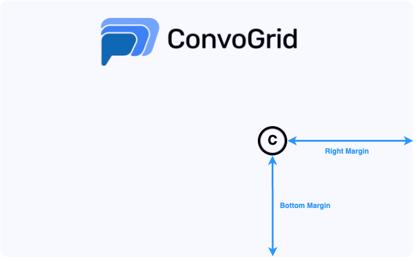

# Convo Connector

This guide outlines the steps to integrate your Convo Bot with your platform, enabling seamless interaction with your users.

 ### 1. Verify your Domain
Before integrating your bot into your platform, domain ownership verification is required. To verify your domain email to `support@convogrid.ai` with the subject `Convo Connector`
mentioning the name of your bot and the domain name.

Upon receipt of your email, a support engineer will get in touch with you to guide you through the next steps.


 ### 2. Integrate the Connector 

Once your domain is verified, the final step is to integrate the bot into your platform. To do so add the provided script tag to your website’s HTML.
```javascript
 <script id="convobot_extension" right-margin="3vw" bottom-margin="3vh"  src="https://content-beta.convogrid.ai/script/extension.64a3691d9dcc4852ddcd978d5ee4aa79f6ad2cc2.min.js"></script>
```

And that's it. Your platform is now supercharged with ConvoGrid!


 ## Bot Placement

The default bot placement is `3vw` from the `right-margin` and the `3vh` from the `bottom-margin` of your web application.

<figure><figcaption><p>Convo Bot Placement</p></figcaption></figure>


### Custom Bot Placement

The default bot placement can be customized by passing the `right-margin` and `bottom-margin` attributes in the script tag.

### Dynamic Bot Relocation

The bot's location can be modified using the `convoExtensionPosition` API.

```javascript
// 5vh up and 5vw left from the bottom right corner of the document
window.convoExtensionPosition({rightMargin:'5vw',bottomMargin: '5vh'})

// 5vh up and 3vw (or right-margin value if persented) left from the bottom right corner of the document
window.convoExtensionPosition({bottomMargin: '5vh'})

// 5vw left and 3vh (or bottom-margin value if persented) up from the bottom right corner of the document
window.convoExtensionPosition({rightMargin: '5vw'})
```

<iframe height="700" style="width: 100%;" scrolling="no" title="Convo Connector" src="https://codepen.io/ConvGridAI/embed/XWvLjrg?default-tab=html%2Cresult&editable=true" frameborder="no" loading="lazy" allowtransparency="true" allowfullscreen="true">
  See the Pen <a href="https://codepen.io/ConvGridAI/pen/XWvLjrg">
  Convo Connector</a> by ConvoGrid AI (<a href="https://codepen.io/ConvGridAI">@ConvGridAI</a>)
  on <a href="https://codepen.io">CodePen</a>.
</iframe>

 ## FAQ

 ### 1. Can anyone integrate my bot in their platforms? 

Your bot is unique to your verified domain. It's not possible for someone else to use your bot in their platform. 

### 2. Can I customize the look and feel?
Customization options are available via the [Edit Bots](../../my-bots/edit-bots.md). If further customization is needed, feel free to contact us at `support@convogrid.ai`.

