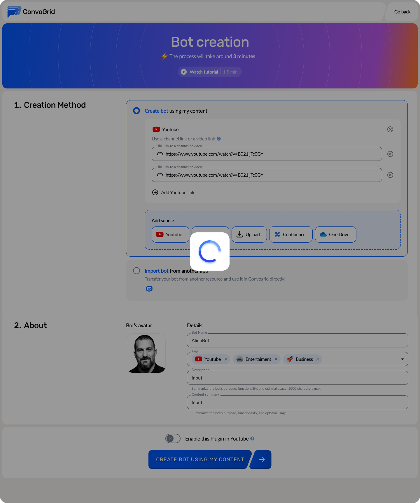

# Completing the process

After you fill out the form with all the necessary information, you can proceed to publish the bot by clicking on the arrow mark that appears next to the "Create Bot using my content" label at the bottom of the page.

<figure><figcaption>
Click on arrow
</figcaption></figure>

 

<figure><figcaption>
Loading
</figcaption></figure>

After the process is completed, you will be directed to the interface shown below.

<figure><figcaption>
Bot crafting
</figcaption></figure>

You will be able to visualize your bot being created, and as this is a big process, it may take few minutes to complete. Once it is done, the bot will be ready to use and you can publish the bot to make it public.

<figure><figcaption>
Bot is created
</figcaption></figure>
