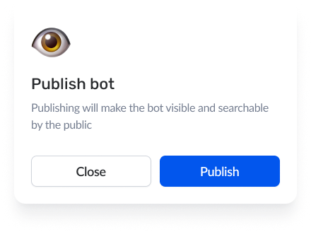

# Publishing the bot

Once the bot is created, you can publish your bot by clicking on the arrow that appears next to the "Publish Bot" label on the bot card.

&#x20;

<figure><figcaption>
Publish Bot
</figcaption></figure>

When you click on that arrow, a confirmation message will pop up on the screen.

<figure><figcaption>
Modal
</figcaption></figure>

Then, by clicking on the "Publish" button, you can finally publish your bot and make it visible to everybody. After you publish the bot, you can view your bot card as shown below.

<figure><figcaption>
Published the bot
</figcaption></figure>
