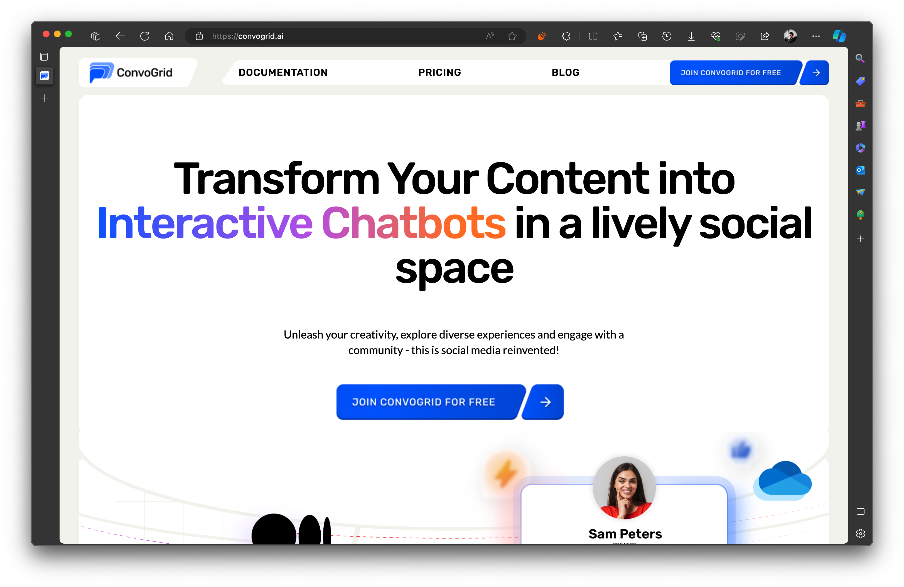
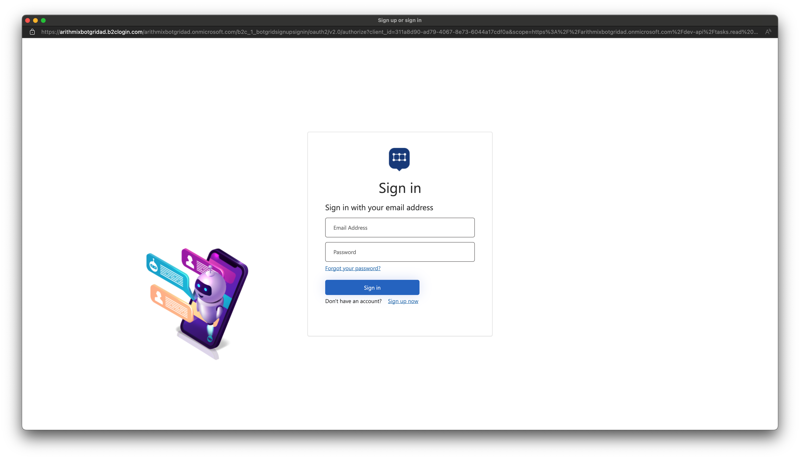

# Getting started

## :bulb: Let's Get Started with ConvoGrid!

Getting started with Convogrid is super easy and intuitive. If you are new here, don't worry; we'll guide you through the initial steps, from visiting the website to exploring the main menu. With easy-to-follow instructions (and soon-to-be-added screenshots), you'll be navigating ConvoGrid like a pro in no time. Let's dive in!

### **Step 1: Visit the ConvoGrid Website**

* Launch your preferred web browser on your computer or mobile device, whatever you prefer. (You may even use the browser you are reading this guide from).
* Visit [https://convogrid.ai](https://convogrid.ai/) or search for ConvoGrid on your search engine, after which you'll be taken to the landing page of ConvoGrid.
* Take a moment to look around the homepage. Here, you'll find an overview of what ConvoGrid offers, including features, user testimonials, and more.

<figure><figcaption>
The ConvoGrid Landing Page
</figcaption></figure>

### Step 2: Launching ConvoGrid

* Once you are done, simply select the "Join ConvoGrid for free" button.
* You will be greeted with this interface where you can search for Bots, make your own Bots, or even interact with the already available Bots.&#x20;

<figure><figcaption>
ConvoGrid Platform in different devices
</figcaption></figure>

### Step 3: Creating an Account or Sign In

When you select any option, you will be prompted to log in, as shown below.

<figure><figcaption>
Sign In page
</figcaption></figure>

You can sign in if you have an account by entering your credentials or sign up for a new account by clicking on the "Sign up now" button.

<figure><figcaption>
Registration form
</figcaption></figure>

Once you are done, you will be directed to the option you choose, and you can continue using the app accordingly.

Feeling overwhelmed?? Don't worry; we will be breaking down all of the options in the upcoming sections, which you can easily navigate through the table of contents on the side.

If you are interested to find out about how you can be a Content Creator on ConvoGrid, you cancheck out the next section, or you can check out how you can [search for a ConvoBot on ConvoGrid](../../starting-a-conversation/finding-convobots/).

